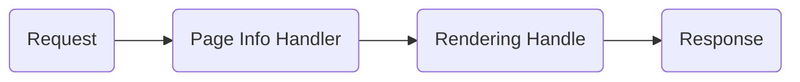

# Enpage Server

Base server to serve Enpage websites. Available for Node.js and Cloudflare Workers.


## Architecture

The server relies on 2 main components (handlers) to serve the website:

1. **Page context handler (required)**: This handler is responsible for retrieving the page context.
It is the only handler that is required to be implemented by the user.

2. **Rendering handler** (optional): This handler is responsible for rendering the page. It is provided by default,
but can be replaced by your own if needed.

---

**Schema**



## Writing your own Page Info Handler

The page info handler must fill the `ctx.locals.pageContext` object to store the page context.


## Enpage REST API signatures

### `GET /sites/:hostname/config`

Get the site configuration.

#### Request Example

```http
GET /sites/joe.enpage.co/config
```

#### Response Example

```json5
{
  "attributes": {
    "$siteTitle": "Enpage",
    "$siteDescription": "A dynamic site generator",
    "$siteKeywords": ["enpage", "dynamic site generator"],
  },
  "datasources": {
    "links": {
      // ...
    }
  },
  "pages": [
    {
      "path": "/",
      "attributes": {
        "$pageTitle": "Home",
        "$pageDescription": "Welcome to Enpage",
        "$pageKeywords": ["enpage", "dynamic site generator"]
        // ...
      }
    }
  ]
}
```

### `GET /site/:hostname/context/:path`

Get the page context. `:path` is the path of the page.

#### Request Example

For a given request `https://sample.enpage.co/my/super/page`, the API call to get the page context would be:

```http
GET /sites/sample.enpage.co/context/my/super/page
```

#### Response Example

```json5
{
  // site attributes are merged with page attributes, with page attributes taking precedence
  "attributes": {
    "$siteTitle": "Enpage",
    "$siteDescription": "A dynamic site generator",
    "$siteKeywords": ["enpage", "dynamic site generator"],
    "$pageTitle": "Home",
    "$pageDescription": "Welcome to Enpage",
    "$pageKeywords": ["enpage", "dynamic site generator"]
    // ...
  },
  // Page data
  "data": {
    "links": {
      // ...
    }
  }
}
```

